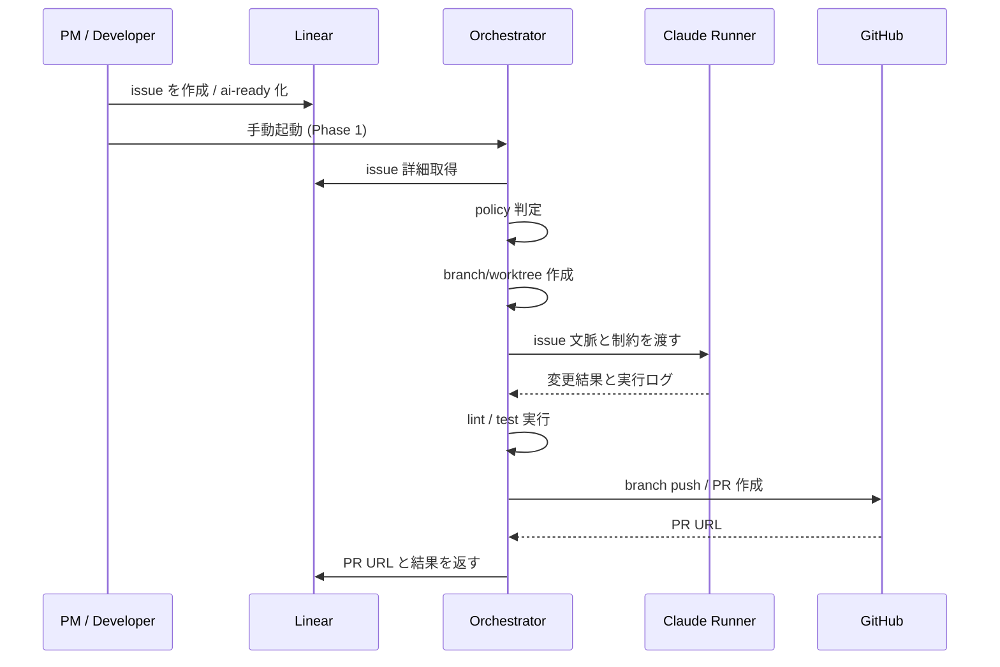

# Sequence: Linear to PR

## ハッピーパス

## 失敗パス

1. issue の policy 判定に落ちた場合:
   - 実行しない
   - Linear へ対象外理由を返す
2. Claude 実行が失敗した場合:
   - branch / worktree を run 単位で隔離したまま終了する
   - Linear に失敗理由を返す
3. lint / test が失敗した場合:
   - PR は作らない
   - ログと失敗内容を Linear へ返す
4. GitHub PR 作成が失敗した場合:
   - branch の有無を run summary に残す
   - Linear に GitHub 連携失敗として返す

## Phase ごとの入口

- **Phase 1**:
  - 人が Linear issue を見て Orchestrator を手動起動する
- **Phase 2**:
  - `label=ai-ready` を契機に job を自動作成する
- **Phase 3 以降**:
  - queue を経由して並列実行する
